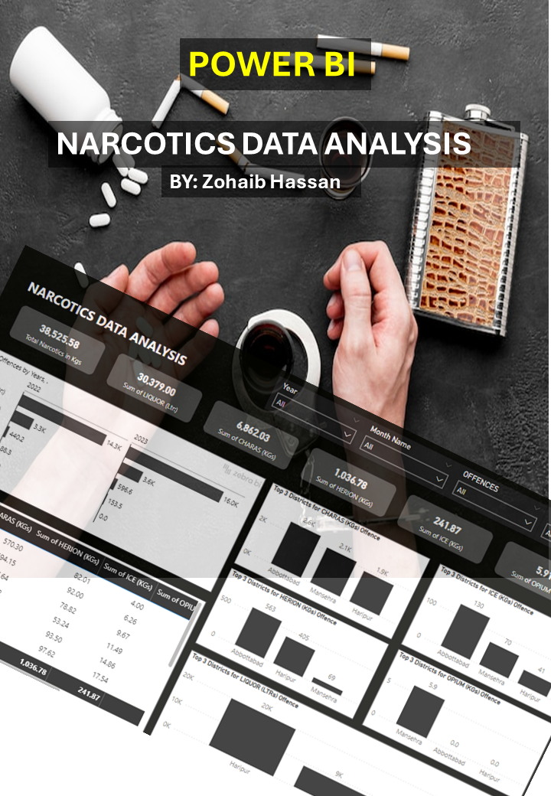

# Narcotics-Data-Analysis-Power-Bi-Project
Welcome to the Narcotics Data Analysis Power BI Project! This project is designed to provide a comprehensive analysis of narcotics data from various dimensions such as regions, drugs, usage frequency and districts using Power BI.

## Project Overview

The goal of this project is to create a Power BI dashboard that allows users to monitor and analyze narcotics data effectively. This analysis is crucial for understanding patterns and trends in narcotics usage, which can inform policy-making and targeted interventions.

## Project Features

- **Multi-Dimensional Analysis**: Analyze narcotics data from different perspectives including regions, types of drugs, usage patterns, districts, and frequency.
- **Interactive Dashboard**: Utilize Power BI to create an interactive and user-friendly dashboard.
- **Detailed Reports**: Generate detailed reports to support decision-making and policy formulation.
- **Insightful Visualizations**: Leverage Power BI's visualization capabilities to present data in an accessible and understandable manner.

## Project Files

- **Project Detail.pdf**: Complete detail about the project.
- **Dataset**: The dataset used for the project (Passcode: 332211).
- **Screenshot of Project**: Visuals of the Power BI dashboard and analysis.

## Project YouTube Link

Watch the complete project walkthrough on [YouTube](https://www.youtube.com/watch?v=r924cCGnjhs).

   

## FeedBack
If you have any feedback, suggestions, or questions about these projects, feel free to open an issue or reach out to me directly.

## Copyright Notice: 

All projects and content in this repository are the intellectual property of Zohaib Hassan. You are welcome to view, fork, and modify the code for personal or educational purposes. However, any commercial use or distribution of these projects, either in part or in whole, without explicit permission from the author, is strictly prohibited.

If you need access to the complete dashboard or have any questions, feel free to contact me via email or connect with me on LinkedIn.

For commercial usage or distribution permissions, please contact me at zohaib.atd92@gmail.com for licensing inquiries.

Thank you for respecting the author's rights and intellectual property.

Author: Zohaib Hassan
